# Hands-on VPC-02 : Creating Bastion Host, Elastic IP, NAT Gateway, NAT Instance and connect to the private subnet from internet

## Part 1 - Creating Bastion Host and connect to the private subnet from internet

- discuss about how to connect to the "az1a-private-subnet" instance

- Explain logic of why we need Bastion Host?

- Launch two Instances.
One is in Private Subnet-1a the other one is in Public Subnet-1a

- Configure Private instance.

```text
AMI             : Amazon Linux 2
Instance Type   : t2.micro
Keypair         : your key
Network         : myVPC
Subnet          : az1a-private-subnet
Security Group  : 
    Sec.Group Name : Private Sec.group
    Rules          : TCP --- > 22 ---> Anywhere
                     All ICMP IPv4  ---> Anywhere
Tag             :
    Key         : Name
    Value       : Private EC2
```

- Configure Public instance (Bastion Host).

```text
AMI             : Amazon Linux 2
Instance Type   : t2.micro
Key-pair        : your key
Network         : myVPC
Subnet          : az1a-public-subnet
Security Group  : 
    Sec.Group Name : Public Sec.group(Bastion Host)
    Rules          : TCP  ---> 22 ---> Anywhere
                   : All ICMP IPv4 ---> Anywhere
                     HTTP  ---> 80 ---> Anywhere
                     HTTPs ---> 443 ---> Anywhere (Update your security group if this port is missing)
Tag             :
    Key         : Name
    Value       : Public EC2 (Bastion Host)
```

- This configuration adds an extra layer of security and can also be used.

```text
Rules        : TCP --- > 22 ---> Anywhere
                |         |         |
                |         |         |
                V         V         V
               TCP --- > 22 ---> Public Sec.Group
```

- Try to connect private instance via ssh
  (As you see in the dashboard there is no public IP for instance)

- show that you can't connect directly to private instance from local with ssh connection.

- Since there is no public IP of private instance, we need to connect ssh via Bastion Host instance

- to be able to coonect to the private instance via public, we need our pem file to be copied onto the public instance.

- **Way 1**: to copy pem file from our local to the public instance we use secure copy command:

```bash
    sudo scp -i key.pem  keypemfiletocopy ec2-user@54.173.107.127:/home/ec2-user/
```

- this method copies any file securely to the remote destination.

- **Way 2**: another way to copy pem file to remote is using vscode to drag and drop the file to the remote folder
  
  
  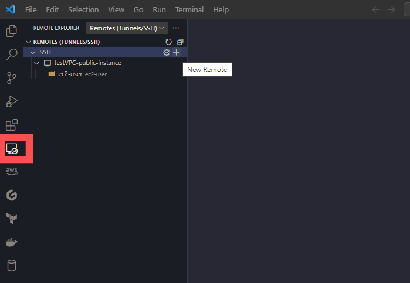

  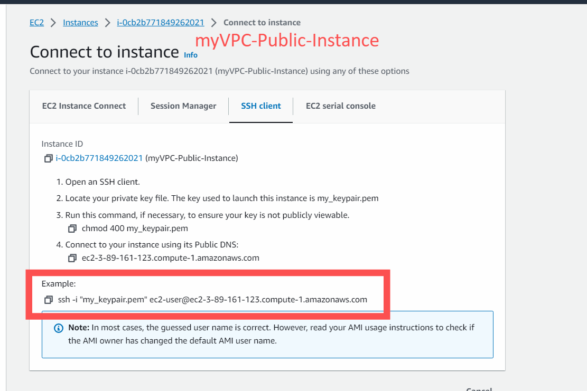

  

  

  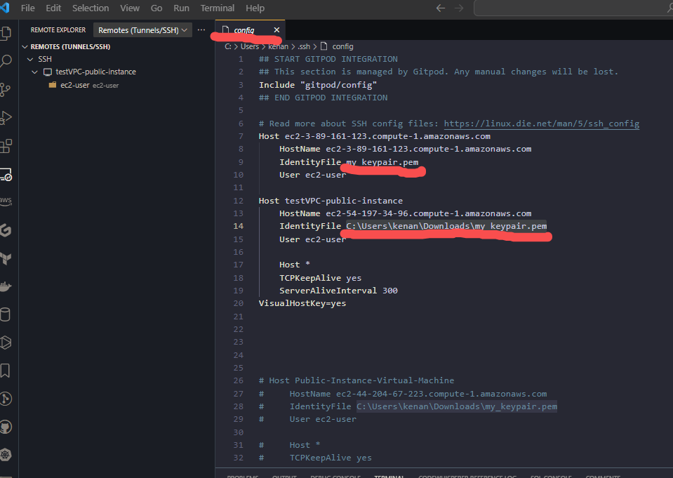

  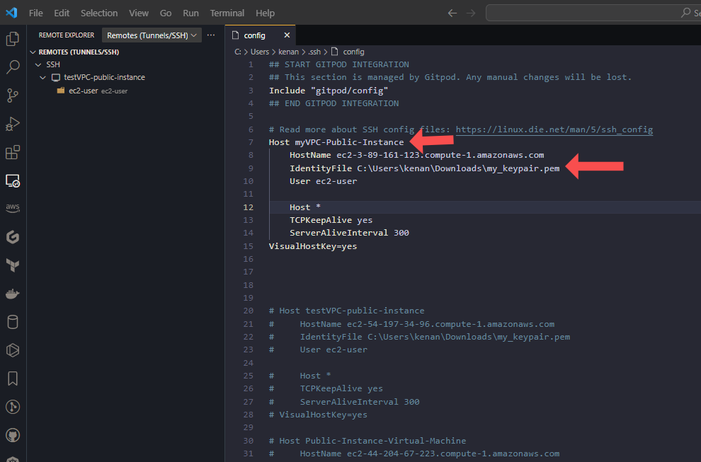

  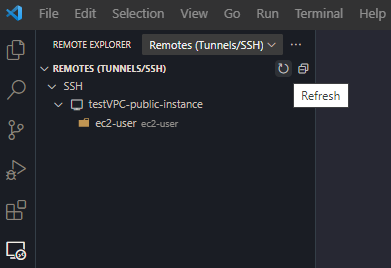

  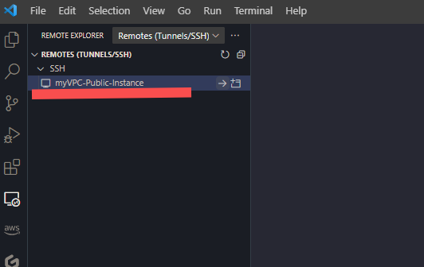

  

  
  
  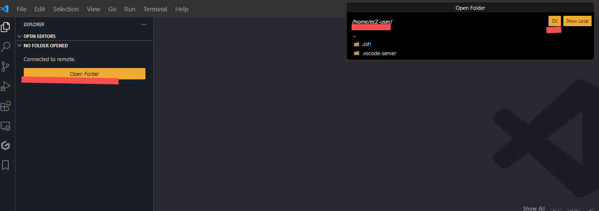

  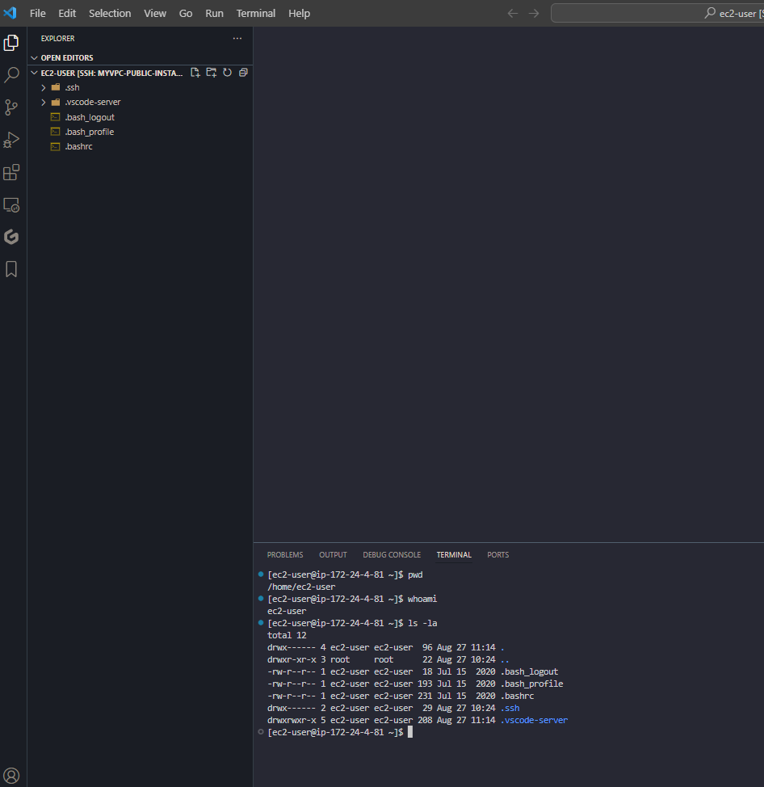

  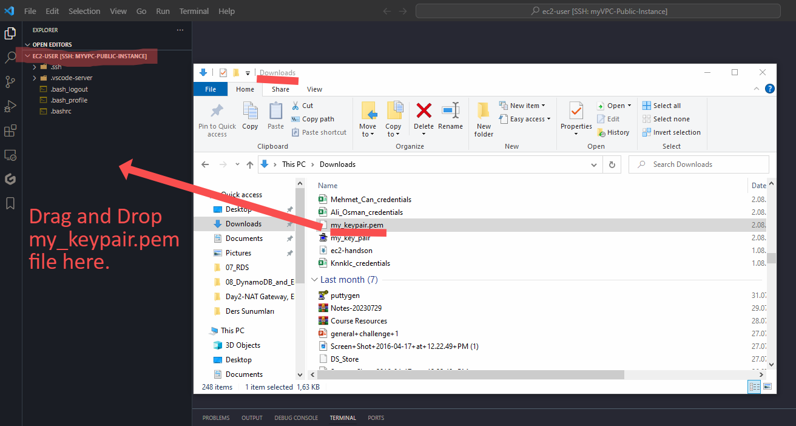
  
  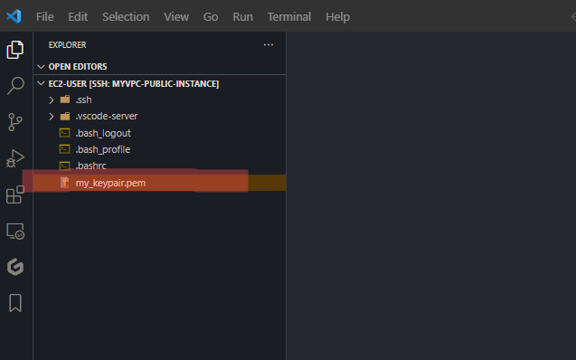

  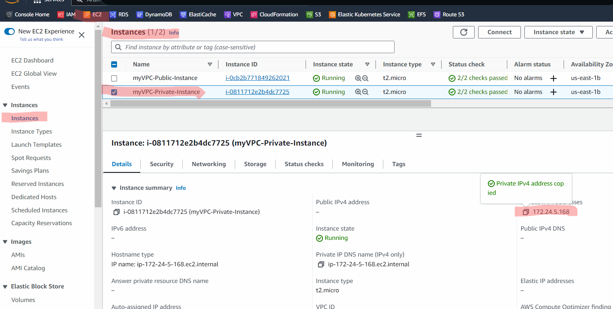

- sudo ssh -i my_keypair.pem ec2-user@myVPC-Private-InstanceIP
  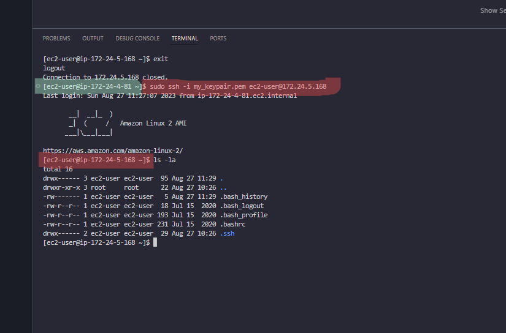

- **Way 3**: another way to copy pem file is to use nano to create pem file in /home/ec2-user directory, then copying the content of pem file on local computer into the pem file in nano editor.

- **Way 4**: another way to do all is using ssh agent, to do this follow on ..

- in your local terminal

- Enable ssh-agent (start the ssh-agent in the background)

```bash
    eval "$(ssh-agent)"
```

- Add your private key to the ssh agent on your `localhost`. `ssh-agent is a program that runs in background and stores your keys in memory`.

```bash
    ssh-add ./[your pem file name]
```

- connect to the ec2 instance az1a-public-subnet instance in public subnet.

- if we don't want to create a config file, we have another option, using -A flag with the ssh command. `-A` option `enables forwarding of the authentication agent connection`. It means that, it forwards your SSH auth schema to the remote host. So you can use SSH over there as if you were on your local machine.

```bash
ssh -A ec2-user@ec2-3-88-199-43.compute-1.amazonaws.com
```
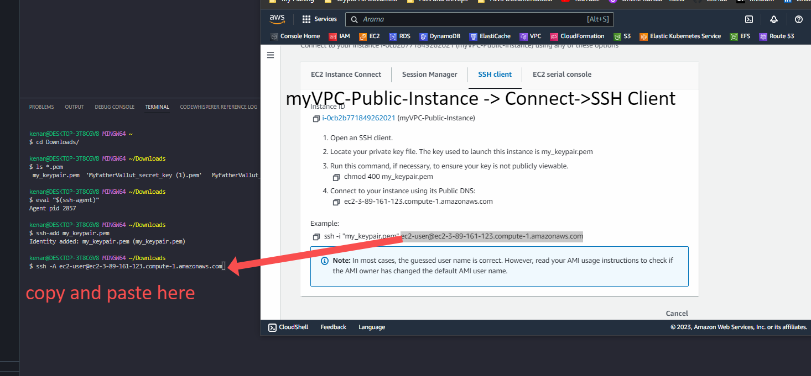

- once logged into the ec2-in-az1a-public-sn (bastion host/jump box), connect to
the ec2-in-az1a-private-sn instance in the private subnet

```bash
ssh ec2-user@[Your private EC2 private IP]
```
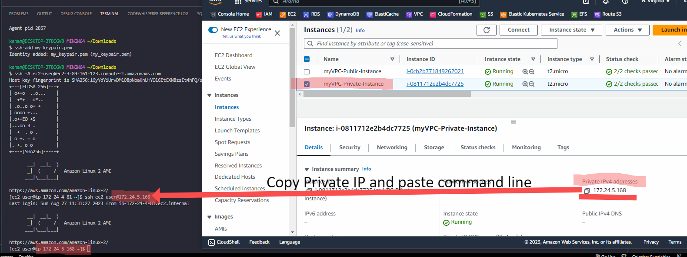

- Show connection of the private EC2 over the Bastion Host

- Try pinging facebook.com
  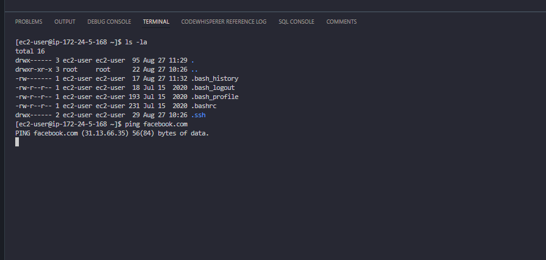
- We were able to access the inside of the private device, but as shown in the figure, this device does not have access to the internet.
We need to use **NAT GATEWAY**, **NAT INSTANCES** and **Route Tables** structures to enable our private device to access the internet.

## Part 2 - Creating NAT Gateway

- discuss about how to connect to internet from the Private EC2 in private subnet

### Step 1 : Create Elastic IP

- Go to VPC console on left hand menu and select Elastic IP tab

- Tab Allocate Elastic IP address

Elastic IP address settings

```text
Network border Group : Keep it as is (us-east-1)

Amazon's pool of IPv4 addresses
```

- Click Allocate button and name it as "First Elastic IP"

- create a NAT Gateway in the public subnet

### STEP 2: Create Nat Gateway

- Go to VPC console on left hand menu and select Nat Gateway tab

- Click Create Nat Gateway button

```bash
Name                      : my-nat-gateway

Subnet                    : az1a-public-subnet

Elastic IP allocation ID  : First Elastic IP
```

- click "create Nat Gateway" button
  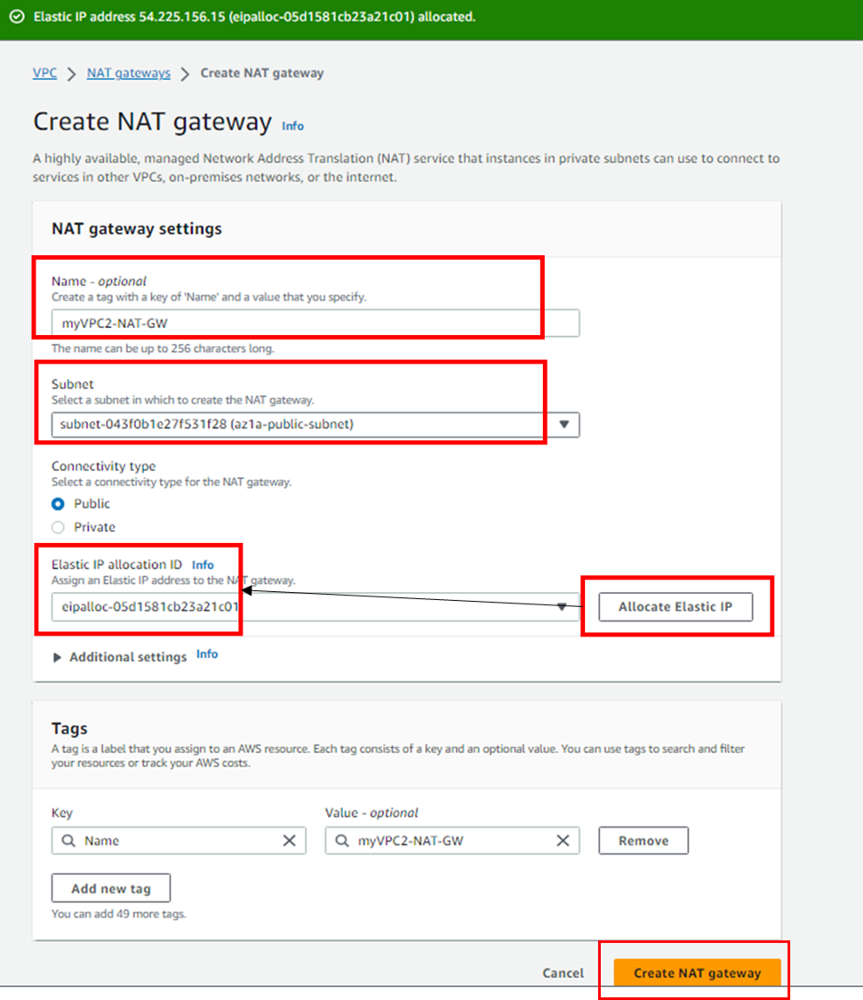
STEP 3 : Modify Route Table of Private Instance's Subnet

- Go to VPC console on left hand menu and select Route Table tab

- Select "private-rt" ---> Routes ----> Edit Rule ---> Add Route
  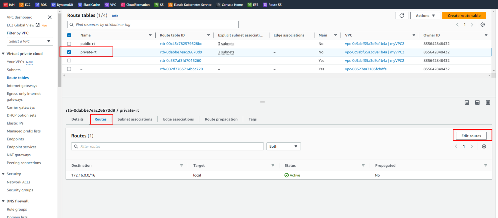

```text
    Destination     : 0.0.0.0/0
    Target ----> Nat Gateway ----> my-nat-gateway
```

- click save routes
  

- go to private instance via terminal using bastion host

- try to ping <www.google.com> and show response.
  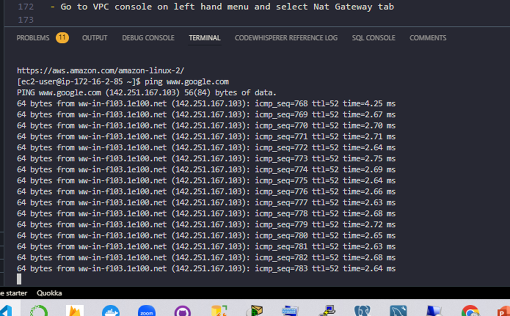
## Delete NAT Gateway and Release EIP

- Go to VPC console on left hand menu and select Nat Gateway tab

- Select my-nat-gateway --- > Actions ---> delete Nat Gateway

- Go to VPC console on left hand menu and select Elastic IP tab

- Select "First Elastic IP" ----> Actions ----> Release Elastic IP Address ----> Release

- go to private root table and delete NAT gateway route

## Part 3 - Creating NAT Instance

- search in chrome browser for NAT Instance, go to AWS result page, review the documentation and the script code

### Create NAT Instance

- there are 2 ways to create a nat instance.

- **Way 1**: create your own nat instance. Connect to or launch an instance in a public subnet. ssh to instance and run script for NAT configuration.

```bash
echo 1 > /proc/sys/net/ipv4/ip_forward
iptables -t nat -A POSTROUTING -s 172.16.0.0/16 -j MASQUERADE
```

- exit instance, go to private route table for the private instance. add route for the instance by selecting destination as 0.0.0.0/0, and target as instance, and choose the instance that we have ssh connected and have run scripts for nat configuration.

- do not forget to change nat instance ***source/destination check*** setting so that it enables traffic. do this from ec2 instances window, selecting nat instance and clicking actions and then networking.

- **Way 2**: create an instance from AMIs designed as NAT.

- Go to EC2 Menu Using AWS Console

```text
AMI             : ami-00a36856283d67c39 (Nat Instance)
Instance Type   : t2.micro
Network         : myVPC
Subnet          : az1a-public-subnet
Security Group  : 
    Sec.Group Name : Public Sec.group
    Rules          : TCP ---> 22 ---> Anywhere
                   : All ICMP IPv4  ---> Anywhere

Tag             :
    Key         : Name
    Value       : my NAT Instance
```

- Select created Nat Instance on EC2 list

- Tab Actions Menu ----> Networking ----> Enable Source/Destination Check ---> Yes, Disable

- Explain why we need to implement this process mentioned above

### Configuring the Route Table

- Go to Route Table and select "private-rt"

- Select Routes sub-menu ----> Edit Rules ----> Delete blackhole for Nat Gateway

- Add Route

```text
Destination     : 0.0.0.0/0
Target ----> Instance ----> Nat Instance
```

- Connect to private Instance via bastion host and ping <www.google.com> to show response.

## Delete/Terminate Resources

- Terminate Bastion Host/ NAT Instance/ Private Instance
