# Hands-on Boto3

## Outline

- Part 1 - Installation and Configuration

- Part 2 - Examples of Boto3 usage

## Part 1 - Installation and Configuration

- Open an IDE on Cloud9

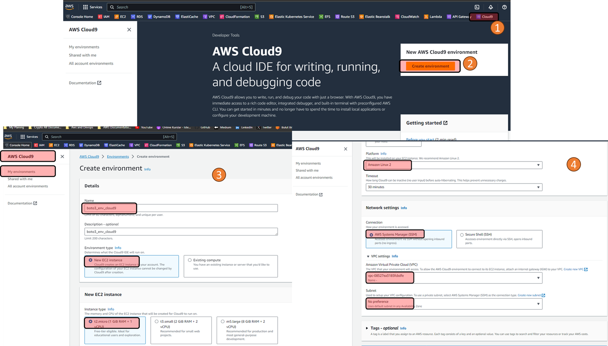
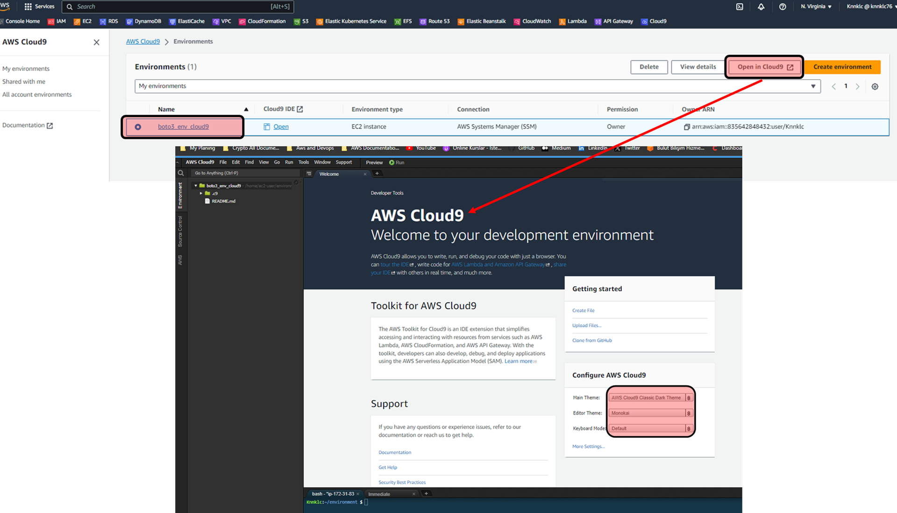

- Use the terminal window to configure before using boto3

- Type to see aws cli version and that aws cli is based on botocore

    ```bash
    aws --version
    ```

- Type to see installed packages

    ```bash
    pip freeze
    ```

- To install Boto3, open your terminal (Commands below works also for Command Prompt-Windows), and type the code below for the latest version.

    ```bash
    pip install boto3
    ```

- If you are using Python3, try:

    ```bash
    pip3 install boto3
    ```

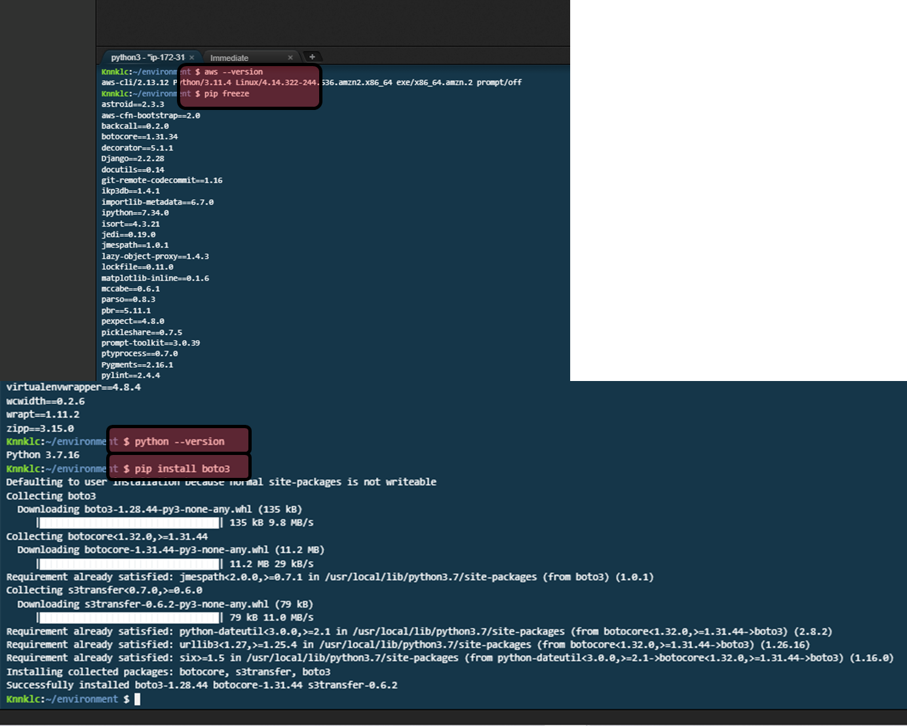

- To be able to use Boto3, you need AWS Credential (Access Key and Secret Key). If you have AWS CLI installed and configured you don't need to do anything. If you don't, create '.aws' directory under home (~), and then create config and credentials file with the necessary data in.

    ```bash
    aws configure
    ```

- Then enter the credentials:

    ```bash
    AWS Access Key ID [****************EMOJ]: 
    AWS Secret Access Key [****************/aND]: 
    Default region name [us-east-1]: 
    Default output format [yaml]: 
    ```

## Part 2 - Examples of Boto3 usage

### STEP-1: List your S3 Buckets

- To be able to use Boto3, first you need to import it (import boto3), then you can type other commands regarding it. Create a file  called s3_bucket_list.py and put the code below in it.

    ```python
    import boto3

    # Use Amazon S3
    s3 = boto3.resource('s3')

    # Print out all bucket names
    for bucket in s3.buckets.all():
        print(bucket.name)
    ```

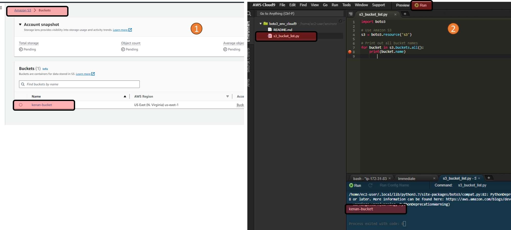

### STEP-2: Create an S3 bucket and list buckets again

- Create a file a called s3_create_bucket.py and put the code below in it.

    ```python
    import boto3

    # Use Amazon S3
    s3 = boto3.resource('s3')

    # Create a new bucket
    s3.create_bucket(Bucket='my-boto3-bucket')

    # Print out all bucket names
    for bucket in s3.buckets.all():
        print(bucket.name)
    ```

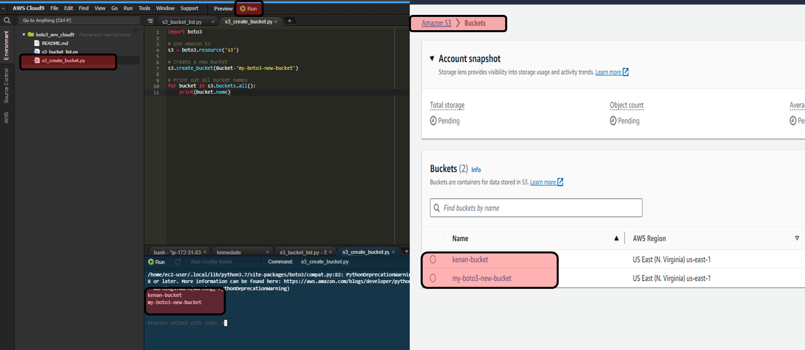

- Show that you can see the new bucket.

### STEP-3: Upload a file to the S3 Bucket

- You need a file in your working directory (test.jpg for this case) to upload.  

- Create a file in your working directory named "test.jpg"

- Create a file a called s3_upload_file.py and put the code below in it.

    ```python
    import boto3

    # Use Amazon S3
    s3 = boto3.resource('s3')

    # Upload a new file
    data = open('test.jpg', 'rb')
    s3.Bucket('my-boto3-bucket').put_object(Key='test.jpg', Body=data)
    ```

    ```python
    # 2. Method : Upload a new file to Amazon S3
    import boto3
    s3 = boto3.client('s3')
    s3.upload_file('your-local-file.txt', 'your-bucket-name', 'your-s3-object-name.txt')
    ```

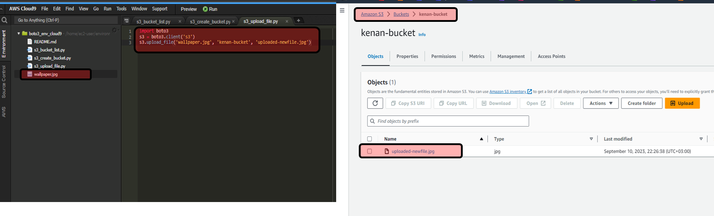

- Check the "my-boto3-bucket", if your script works fine, you should be able to see your test file in your bucket.
  
- Delete the a bucket and all files

    ```python
    import boto3
    # Initialize a session using Amazon S3
    s3 = boto3.resource('s3')

    # Specify the bucket name
    bucket_name = 'kenan-bucket'

    # Fetch the bucket
    bucket = s3.Bucket(bucket_name)

    # Step 1: Delete all objects in the bucket
    for obj in bucket.objects.all():
        obj.delete()

    # Step 2: Delete the bucket
    bucket.delete()

    # Confirm that the bucket has been deleted
    print(f"Bucket {bucket_name} and all its objects have been deleted.")
    ```

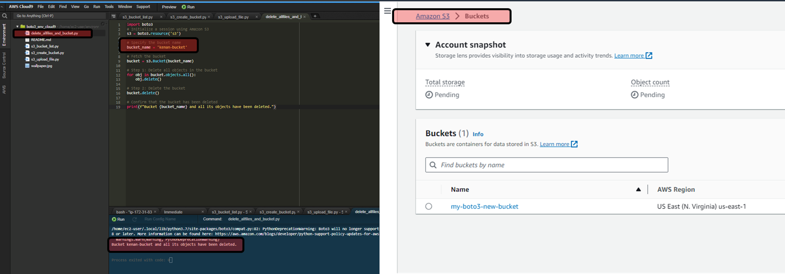

- Create a few buckets

    ```python
    import boto3

    # Use Amazon S3
    s3 = boto3.resource('s3')

    # Create a new bucket
    names = ['ali', 'mehmet', 'omer', 'adnan', 'ayse']

    for name in names:
        # Bucket names must be unique, you may need to add some uniqueness to the names
        bucket_name = f"{name}-s3-boto3"  
        s3.create_bucket(Bucket=bucket_name)

    for bucket in s3.buckets.all():
        print(bucket.name)
    ```

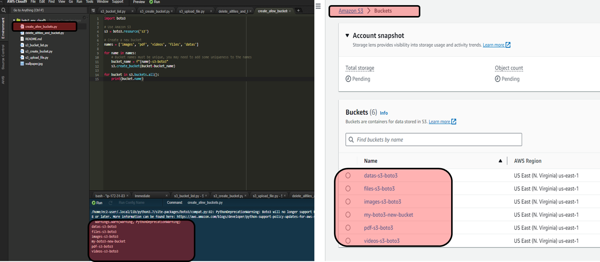

- Delete all buckets

    ```python
    import boto3

    # Initialize a session using Amazon S3
    s3 = boto3.resource('s3')

    # List all bucket names
    bucket_list = [bucket.name for bucket in s3.buckets.all()]
    print("Bucket list:", bucket_list)

    # Loop to iterate through all buckets
    for bucket_name in bucket_list:
        # Initialize the S3 bucket resource
        bucket = s3.Bucket(bucket_name)

        # Delete all objects in the bucket
        for key in bucket.objects.all():
            key.delete()
        print(f"Deleted all objects from bucket {bucket_name}")

        # Delete the bucket itself
        bucket.delete()
        print(f"Deleted bucket {bucket_name}")
    ```

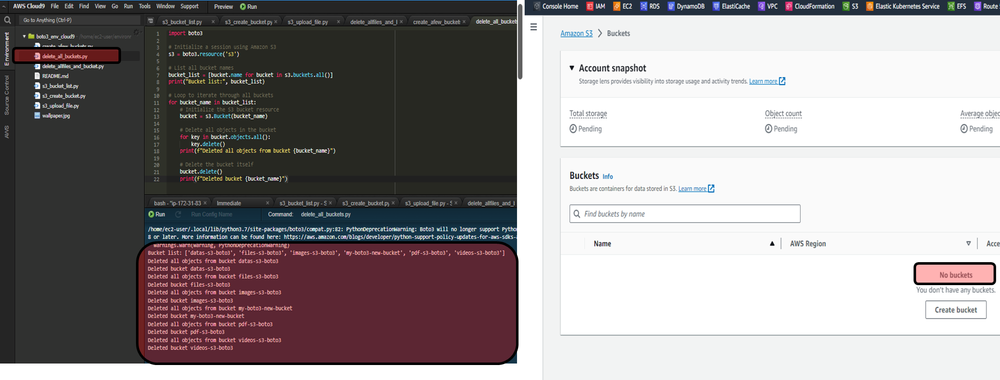

### STEP-4: Launch, Stop and Terminate Instances

- Create a file a called create_new_EC2_instance.py and put the code below in it to launch an Ubuntu instance. You may change the instance ID to create different types of instances.

    ```python
    import boto3
    ec2 = boto3.resource('ec2')

    # create a new EC2 instance
    instances = ec2.create_instances(
        ImageId='ami-0f409bae3775dc8e5', # Amazon Linux 2 Kernel 5.10 AMI. id
        MinCount=1,
        MaxCount=1,
        InstanceType='t2.micro',
        KeyName='my_keypair'             # paste here your keypair without .pem
    )
    ```

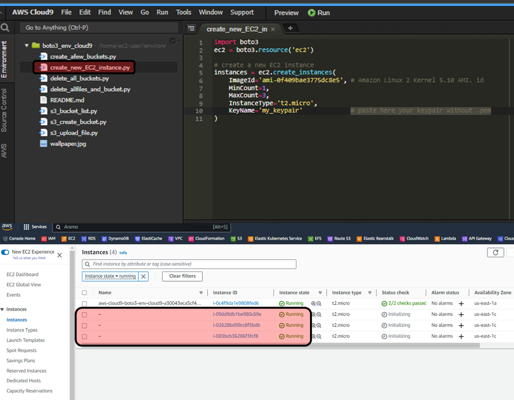

- Describe instances
  
    ```python
    import boto3

    ec2 = boto3.client('ec2')
    response = ec2.describe_instances()

    for reservation in response['Reservations']:
        for instance in reservation['Instances']:
            print("ID: {}, State: {}, Type: {}".format(
                instance['InstanceId'],
                instance['State']['Name'],
                instance['InstanceType']))
    
    ```

- Checked the newly created instance

- Create a file a called stop_any_EC2_instance.py and put the code below in it to stop EC2 instance via boto3.

    ```python
    import boto3
    ec2 = boto3.resource('ec2')
    ec2.Instance('your InstanceID').stop()  # put your instance id 'i-09dd9db1be980c69e'
    ```

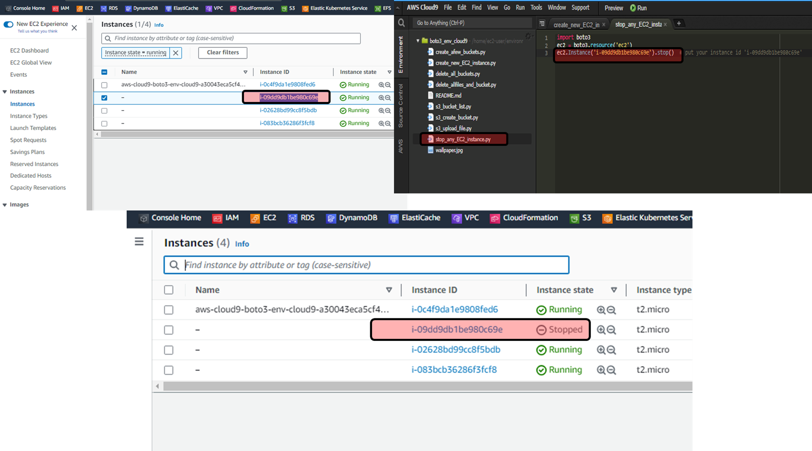

- Create a file a called terminated_any_EC2_instance.py and put the code below in it to terminate EC2 instance via boto3.

    ```python
    import boto3
    ec2 = boto3.resource('ec2')
    ec2.Instance('your InstanceID').terminate() # put your instance id
    ```

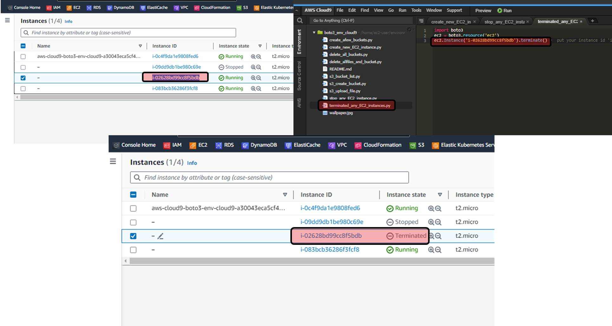

- Check the EC2 instance status from console.
  
- Stop the All EC2 instance avoid AWS Cloud9 Instance

    ```python
    import boto3

    # Initialize EC2 resource
    ec2 = boto3.resource('ec2')

    # Initialize EC2 client
    client = boto3.client('ec2')

    # Get list of all running instances
    running_instances = ec2.instances.filter(
        Filters=[{'Name': 'instance-state-name', 'Values': ['running']}]
    )

    # List to store instances to stop
    instances_to_stop = []

    # Loop through all running instances
    for instance in running_instances:
        # Assume it's not a Cloud9 instance
        is_cloud9 = False

        # Check each tag to see if this is a Cloud9 instance
        for tag in instance.tags or []:
            if tag['Key'] == 'aws:cloud9:environment':
                is_cloud9 = True
                break

        # If it's not a Cloud9 instance, add it to the list of instances to stop
        if not is_cloud9:
            instances_to_stop.append(instance.id)

    # Stop instances
    if instances_to_stop:
        client.stop_instances(InstanceIds=instances_to_stop)
        print(f"Stopped instances: {instances_to_stop}")
    else:
        print("No instances to stop.")
    ```

- Start any instances

    ```python
    import boto3

    ec2 = boto3.client('ec2')
    ec2.start_instances(InstanceIds=['your-instance-id'])
    ```

- Terminated all instances avoid cloud9

    ```python
    import boto3

    # Initialize EC2 resource
    ec2 = boto3.resource('ec2')

    # Initialize EC2 client
    client = boto3.client('ec2')

    # Get list of all instances (you can also filter by only running instances if you prefer)
    instances = ec2.instances.all()

    # List to store instances to terminate
    instances_to_terminate = []

    # Loop through all instances
    for instance in instances:
        # Assume it's not a Cloud9 instance
        is_cloud9 = False

        # Check each tag to see if this is a Cloud9 instance
        for tag in instance.tags or []:
            if tag['Key'] == 'aws:cloud9:environment':
                is_cloud9 = True
                break

        # If it's not a Cloud9 instance, add it to the list of instances to terminate
        if not is_cloud9:
            instances_to_terminate.append(instance.id)

    # Terminate instances
    if instances_to_terminate:
        client.terminate_instances(InstanceIds=instances_to_terminate)
        print(f"Terminated instances: {instances_to_terminate}")
    else:
        print("No instances to terminate.")
    ```

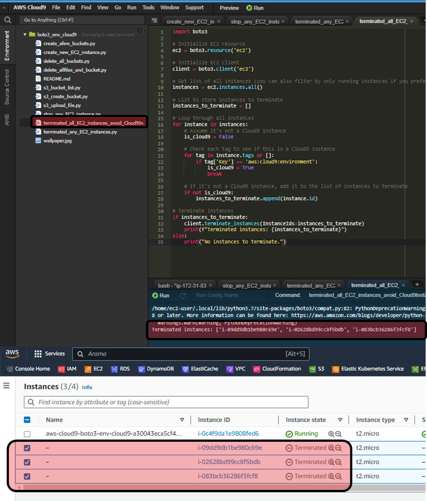

- Terminated all instances including cloud9

    ```python
    import boto3

    # Initialize EC2 client
    client = boto3.client('ec2')

    # Get list of all instance IDs
    response = client.describe_instances()
    instance_ids = [instance['InstanceId'] for reservation in response['Reservations'] for instance in reservation['Instances']]

    # Terminate instances
    if instance_ids:
    client.terminate_instances(InstanceIds=instance_ids)
    print(f"Terminated instances: {instance_ids}")
    else:
    print("No instances to terminate.")
    ```

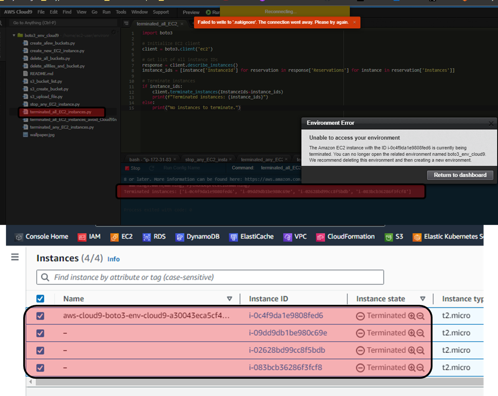

---

Links:

https://aws.amazon.com/sdk-for-python/

https://boto3.amazonaws.com/v1/documentation/api/latest/index.htmlcd