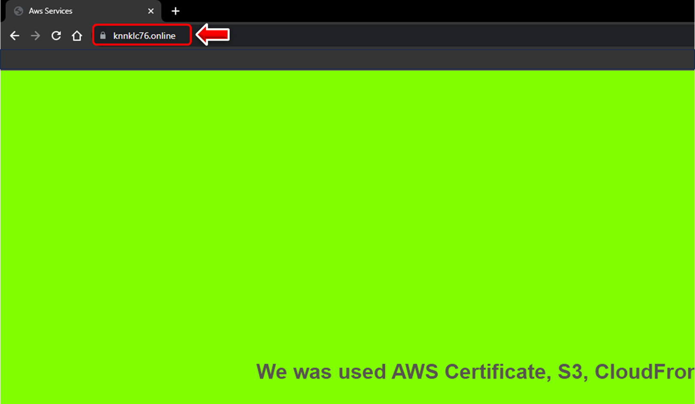
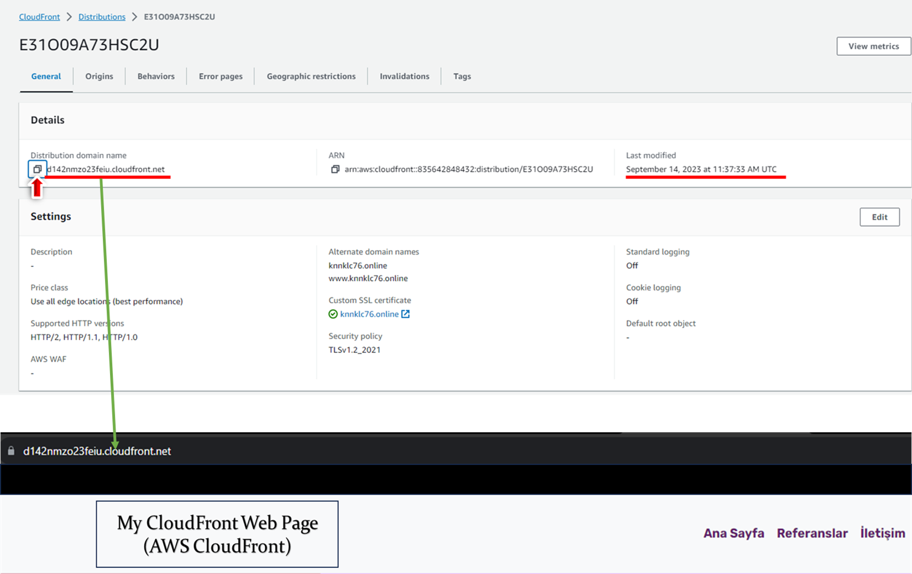

# Hands-on CF-01 : Configuring Cloudfront with Route53, ACM and S3 as Static Website

## Part 1 - Creating a Certificate

- Go to Certificate Manager service and hit "Request a certificate"

- Select "Request a public certificate" and hit "Next"

```text

      -  Domain names               : "[your donamin name].net" (naked domain name)

      -  Select validation method   : "DNS validation"
  
      -  Add tags                   : Skip this part
  
      -  Review and click "Request"
```

- On Certificates page Click on your newly created certificate.

- Under Domains pane click "Create record in Route 53" button.

- Click "Create records" on the pop-up menu.

- It takes a while to be ready (Issued).

- AWS Certificate Manager (ACM) >>> Request certificate >>> Request a public certificate >>> Next >>> Domain names >>> Request >>> "Create record in Route 53" button

## Part 2 - Creating a Static WebSite Hosting

1. Go to S3 service and create a bucket with domain name: "[your-donamin-name].net"


- Public Access Enabled
- Upload Files named "index.html" and "css" in "static-web-v1" folder
- Permissions >>> Bucket Policy >>> Edit >>> Paste bucket Policy - Don't forget to change bucket name in arn.


```json
{
    "Version": "2012-10-17",
    "Statement": [
        {
            "Sid": "PublicReadGetObject",
            "Effect": "Allow",
            "Principal": "*",
            "Action": "s3:GetObject",
            "Resource": "arn:aws:s3:::BUCKET_NAME_HERE/*"
        }
    ]
}
```


- Properties >>> Static Website Hosting >>> Edit >>> Enable >>> Index document : index.html

## Part 3 - Create CloudFront Distribution

- First of all we need to copy endpoint of S3 static website bucket.
  


- Go to S3 click on S3 static website bucket >>> Properties >>> Static Website Hosting >>> Copy the endpoint (without http://).


- Go to CloudFront service and click "Create a CloudFront Distribution"

- Create Distribution :
  - Origin:
    - Origin Domain: Paste the "endpoint" (without http://) of the S3 bucket
  - Default Cache Behavior:
    - Viewer Protocol Policy: Select "Redirect HTTP to HTTPS"
  - Settings
    - Alternate Domain Names (CNAME): [your-domain-name]
    - Custom SSL Certificate: Select your newly created certificate


- Leave the other settings as default.

- Click "Create Distribution".

- It may take some time distribution to be deployed. (Check status of distribution to be "Enabled")


- When it is deployed, copy the "Domain name" of the distribution.
  


## Part 4 - Creating Route 53 record sets (Alias)

- Go to Route53 >>> Hosted Zones,
  


- Click on your public domain name,

- Click "Create record",


```bash
Record Name: None (Leave empty)
Record Type : A
Value: (Turn on Alias)
Route traffic to: 
    - Alias to CloudFront distribution endpoint
    - US East (N.Virginia) [us-east-1]
    - choose your CloudFront distribution endpoint
Routing policy: Simple Routing
```


- Hit "Create records" at the bottom,

- Go to the target domain name "[your DNS name].net" on browser,




- Check if it is working with "https protocol",


- Show the content of web page.
  


## Part 5 - Configuring CloudFront Distribution

Step-1 - Invalidation

- Go to your S3 bucket hosting the website and put the "index.html" file in the "image-v2" folder (not in v1) to your bucket.

- Go to the target domain name "[your DNS name].net" on browser and notice the image has't been changed.

- Go to CloudFront and select the newly created distribution.

- Select the "Invalidations" tab and click "Create Invalidation"

- On the opening page enter "index.html" and click "Invalidate"

- After the invalidation process is completed, check the website and notice the image is updated now.

Step-2 - Geographic Restriction

- Select "Geographic restrictions" tab >>> Edit

- Restriction Type : Block List

- Countries : US-United States

- Click "Save changes"

- Go to your website and show the webpage is blocked.

Step-3 Behaviors create

- Redirect HTTP to HTTPS

- Disable and delete your distribution.

- Delete
  Rout 53 A Record
  CloudFront  Disable >>> delete
  S3 Bucket

## Part 6 - Prep - Launching an Instance

STEP 1 : Create a EC2

- Go to EC2 menu using AWS console
- Launch an Instance
- Configuration of instance.

```text
AMI             : Amazon Linux 2
Instance Type   : t2.micro
Security Group ---> Allows ssh, http, https to anywhere
```


- Set user data.

```bash
#! /bin/bash
yum update -y
amazon-linux-extras install nginx1.12
yum install git -y
systemctl start nginx
cd /usr/share/nginx/html
git clone https://github.com/techproedu/designer.git
chmod -R 777 /usr/share/nginx/html
rm index.html
cp -R ./designer/. .
systemctl restart nginx
systemctl enable nginx

```


## Part 7 - Create CloudFront Distribution

- Go to CloudFront service and click "Create a CloudFront Distribution"

- Create Distribution :
  - Origin:
    - Origin Domain: EC2 Public IPv4 DNS
    - Protoco : HTTP only
  - Default Cache Behavior:
    - Compress objects automatically :yes
    - Viewer Protocol Policy: Select "Redirect HTTP to HTTPS"
    - Allowed HTTP methods : GET, HEAD, OPTIONS, PUT, POST, PATCH, DELETE
    - Cache key and origin requests : Cache policy and origin request policy (recommended)
    - Cache policy : cachingDisabil
    - Origin request policy - optional : AllViewer
  - Settings
    - Alternate Domain Names (CNAME): [your-domain-name],   add www.
    - Custom SSL Certificate: Select your newly created certificate


- Leave the other settings as default.

- Click "Create Distribution".

- It may take some time distribution to be deployed. (Check status of distribution to be "Enabled")
  


- When it is deployed, copy the "Domain name" of the distribution.

## Part 8 - Creating Route 53 record sets (Alias)

- Go to Route53 >>> Hosted Zones,

- Click on your public domain name,

- Click "Create record",

```bash
Record Name: None (Leave empty)
Record Type : A
Value: (Turn on Alias)
Route traffic to: 
    - Alias to CloudFront distribution endpoint
    - US East (N.Virginia) [us-east-1]
    - choose your CloudFront distribution endpoint
Routing policy: Simple Routing
```


- Hit "Create records" at the bottom,

- Go to the target domain name "[your DNS name].net" on browser,

- Check if it is working with "https protocol",

- Show the content of web page.

