# Remediating EC2 Autoscaling Group Modifications

* Introduction
During this lab, we will learn how to implement a simple remediation solution for correcting changes to a production auto scaling group (ASG) within AWS.

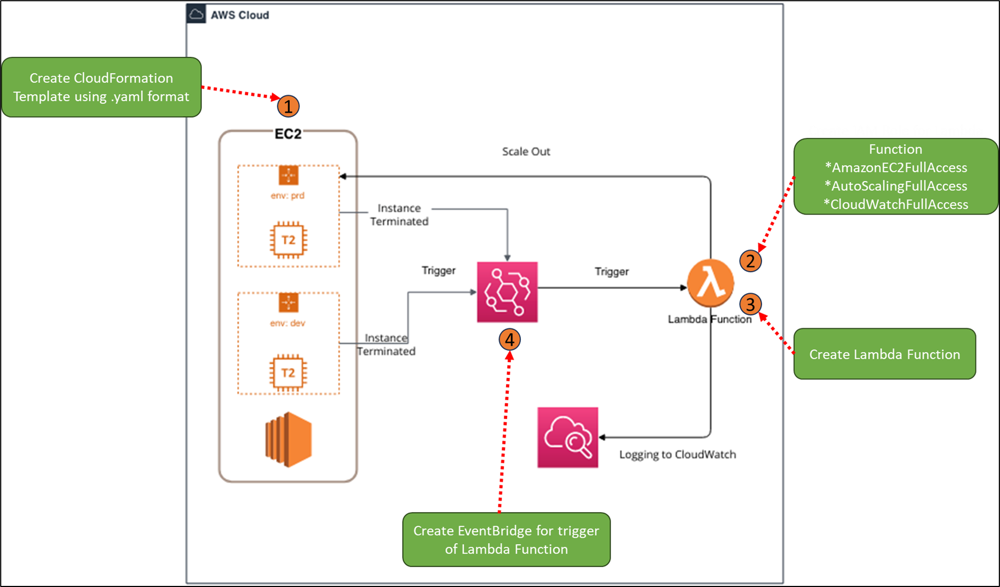

* Here is our scenario:

Your company uses a 'multiple environment to a single AWS account' approach for their EC2 deployments. Your DevOps engineering manager has noticed that there have been several outages due to junior engineers accidentally setting the desired capacity of the production ASG to zero (0). She wants to avoid having to manipulate IAM permissions for now and has asked you to put an auto remediation solution in place to auto recover from these mistakes.

## Let's Do it

* Use Cloudformation template to set up the infrastructure first.
>> cfn-ASG-change.yml


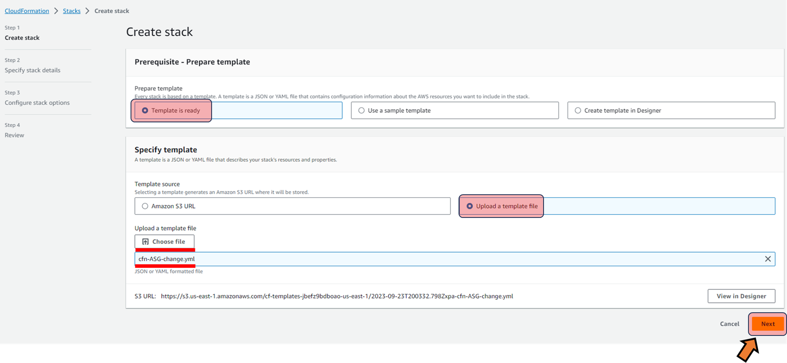
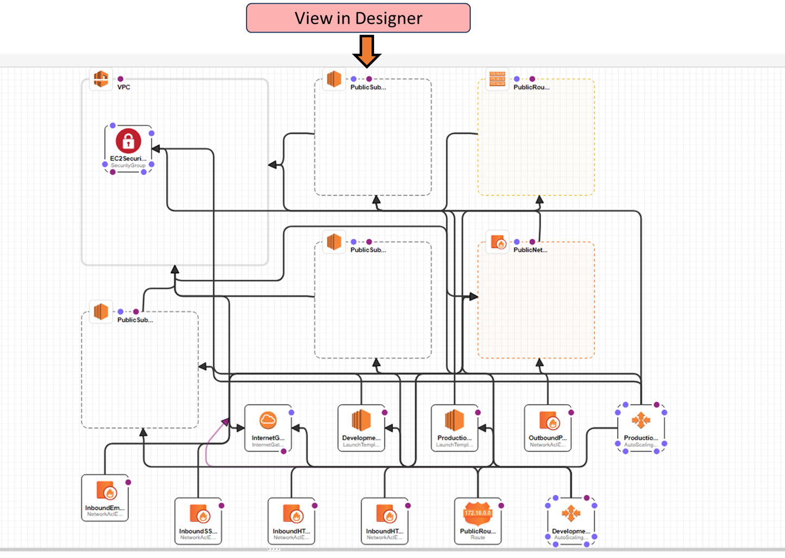
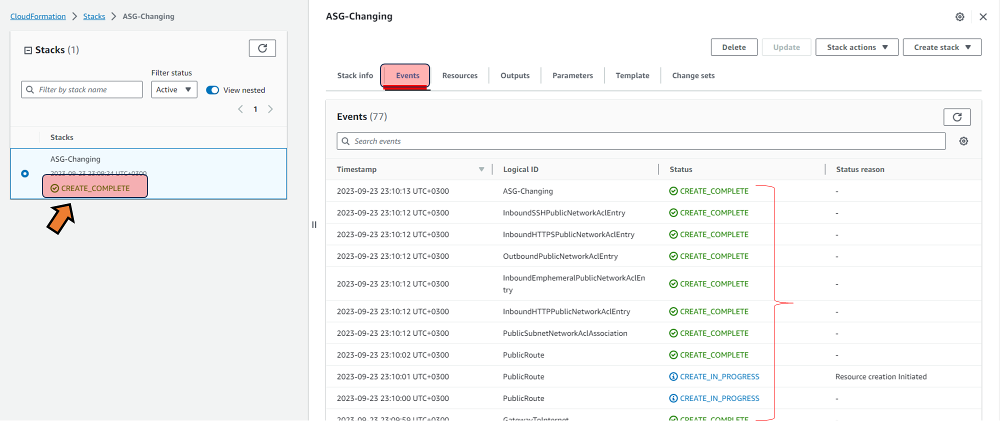

```yaml
AWSTemplateFormatVersion: "2010-09-09"
Description: "Creates two simple AutoScaling Groups within EC2 and a custom Lambda function."
Mappings:
  SubnetConfig:
    VPC:
      CIDR: 10.1.0.0/16
    Public:
      CIDR: 10.1.0.0/24
    Public1:
      CIDR: 10.1.1.0/24
    Public2:
      CIDR: 10.1.2.0/24
Resources:
  #-------------#
  # VPC related #
  #-------------#
  VPC:
    Type: AWS::EC2::VPC
    Properties:
      EnableDnsSupport: "true"
      EnableDnsHostnames: "true"
      CidrBlock:
        Fn::FindInMap:
          - SubnetConfig
          - VPC
          - CIDR
      Tags:
        - Key: Application
          Value:
            Ref: AWS::StackName
        - Key: Network
          Value: Public
  PublicSubnet:
    Type: AWS::EC2::Subnet
    Properties:
      VpcId:
        Ref: VPC
      AvailabilityZone:
        Fn::Select:
          - "0"
          - Fn::GetAZs: ""
      CidrBlock:
        Fn::FindInMap:
          - SubnetConfig
          - Public
          - CIDR
      Tags:
        - Key: Application
          Value:
            Ref: AWS::StackName
        - Key: Network
          Value: Public
  PublicSubnet1:
    Type: AWS::EC2::Subnet
    Properties:
      VpcId:
        Ref: VPC
      AvailabilityZone:
        Fn::Select:
          - "1"
          - Fn::GetAZs: ""
      CidrBlock:
        Fn::FindInMap:
          - SubnetConfig
          - Public1
          - CIDR
      Tags:
        - Key: Application
          Value:
            Ref: AWS::StackName
        - Key: Network
          Value: Public
  PublicSubnet2:
    Type: AWS::EC2::Subnet
    Properties:
      VpcId:
        Ref: VPC
      AvailabilityZone:
        Fn::Select:
          - "2"
          - Fn::GetAZs: ""
      CidrBlock:
        Fn::FindInMap:
          - SubnetConfig
          - Public2
          - CIDR
      Tags:
        - Key: Application
          Value:
            Ref: AWS::StackName
        - Key: Network
          Value: Public
  InternetGateway:
    Type: AWS::EC2::InternetGateway
    Properties:
      Tags:
        - Key: Application
          Value:
            Ref: AWS::StackName
        - Key: Network
          Value: Public
  GatewayToInternet:
    Type: AWS::EC2::VPCGatewayAttachment
    Properties:
      VpcId:
        Ref: VPC
      InternetGatewayId:
        Ref: InternetGateway
  PublicRouteTable:
    Type: AWS::EC2::RouteTable
    Properties:
      VpcId:
        Ref: VPC
      Tags:
        - Key: Application
          Value:
            Ref: AWS::StackName
        - Key: Network
          Value: Public
  PublicRoute:
    Type: AWS::EC2::Route
    DependsOn: GatewayToInternet
    Properties:
      RouteTableId:
        Ref: PublicRouteTable
      DestinationCidrBlock: 0.0.0.0/0
      GatewayId:
        Ref: InternetGateway
  PublicSubnetRouteTableAssociation:
    Type: AWS::EC2::SubnetRouteTableAssociation
    Properties:
      SubnetId:
        Ref: PublicSubnet
      RouteTableId:
        Ref: PublicRouteTable
  PublicSubnetRouteTableAssociation1:
    Type: AWS::EC2::SubnetRouteTableAssociation
    Properties:
      SubnetId:
        Ref: PublicSubnet1
      RouteTableId:
        Ref: PublicRouteTable
  PublicSubnetRouteTableAssociation2:
    Type: AWS::EC2::SubnetRouteTableAssociation
    Properties:
      SubnetId:
        Ref: PublicSubnet2
      RouteTableId:
        Ref: PublicRouteTable
  PublicNetworkAcl:
    Type: AWS::EC2::NetworkAcl
    Properties:
      VpcId:
        Ref: VPC
      Tags:
        - Key: Application
          Value:
            Ref: AWS::StackName
        - Key: Network
          Value: Public
  InboundHTTPPublicNetworkAclEntry:
    Type: AWS::EC2::NetworkAclEntry
    Properties:
      NetworkAclId:
        Ref: PublicNetworkAcl
      RuleNumber: "100"
      Protocol: "6"
      RuleAction: allow
      Egress: "false"
      CidrBlock: 0.0.0.0/0
      PortRange:
        From: "80"
        To: "80"
  InboundHTTPSPublicNetworkAclEntry:
    Type: AWS::EC2::NetworkAclEntry
    Properties:
      NetworkAclId:
        Ref: PublicNetworkAcl
      RuleNumber: "101"
      Protocol: "6"
      RuleAction: allow
      Egress: "false"
      CidrBlock: 0.0.0.0/0
      PortRange:
        From: "443"
        To: "443"
  InboundSSHPublicNetworkAclEntry:
    Type: AWS::EC2::NetworkAclEntry
    Properties:
      NetworkAclId:
        Ref: PublicNetworkAcl
      RuleNumber: "102"
      Protocol: "6"
      RuleAction: allow
      Egress: "false"
      CidrBlock: 0.0.0.0/0
      PortRange:
        From: "22"
        To: "22"
  InboundEmphemeralPublicNetworkAclEntry:
    Type: AWS::EC2::NetworkAclEntry
    Properties:
      NetworkAclId:
        Ref: PublicNetworkAcl
      RuleNumber: "103"
      Protocol: "6"
      RuleAction: allow
      Egress: "false"
      CidrBlock: 0.0.0.0/0
      PortRange:
        From: "1024"
        To: "65535"
  OutboundPublicNetworkAclEntry:
    Type: AWS::EC2::NetworkAclEntry
    Properties:
      NetworkAclId:
        Ref: PublicNetworkAcl
      RuleNumber: "100"
      Protocol: "6"
      RuleAction: allow
      Egress: "true"
      CidrBlock: 0.0.0.0/0
      PortRange:
        From: "0"
        To: "65535"
  PublicSubnetNetworkAclAssociation:
    Type: AWS::EC2::SubnetNetworkAclAssociation
    Properties:
      SubnetId:
        Ref: PublicSubnet
      NetworkAclId:
        Ref: PublicNetworkAcl
  EC2SecurityGroup:
    Type: AWS::EC2::SecurityGroup
    Properties:
      GroupDescription: Enable access to the EC2 host
      VpcId:
        Ref: VPC
  SGBaseIngress:
    Type: AWS::EC2::SecurityGroupIngress
    Properties:
      GroupId:
        Ref: EC2SecurityGroup
      IpProtocol: tcp
      FromPort: "22"
      ToPort: "22"
      CidrIp: 0.0.0.0/0
  SGHTTPIngress:
    Type: AWS::EC2::SecurityGroupIngress
    Properties:
      GroupId:
        Ref: EC2SecurityGroup
      IpProtocol: tcp
      FromPort: "80"
      ToPort: "80"
      CidrIp: 0.0.0.0/0
  #---------------------#
  # ASG and EC2 related #
  #---------------------#
  ProductionAutoScalingGroup:
    Type: "AWS::AutoScaling::AutoScalingGroup"
    Properties:
      AutoScalingGroupName: "ProductionAutoscalingGroup"
      LaunchTemplate:
        LaunchTemplateId: !Ref ProductionEC2LaunchTemplate
        Version: "1"
      MinSize: 0
      MaxSize: 1
      DesiredCapacity: 1
      Cooldown: 300
      AvailabilityZones:
        - !Sub "${AWS::Region}a"
        - !Sub "${AWS::Region}b"
        - !Sub "${AWS::Region}c"
      HealthCheckType: "EC2"
      HealthCheckGracePeriod: 300
      VPCZoneIdentifier:
        - Ref: PublicSubnet
        - Ref: PublicSubnet1
        - Ref: PublicSubnet2
      TerminationPolicies:
        - "Default"
      ServiceLinkedRoleARN: !Sub "arn:aws:iam::${AWS::AccountId}:role/aws-service-role/autoscaling.amazonaws.com/AWSServiceRoleForAutoScaling"
      Tags:
        - Key: "env"
          Value: "prd"
          PropagateAtLaunch: true
      NewInstancesProtectedFromScaleIn: false

  ProductionEC2LaunchTemplate:
    Type: "AWS::EC2::LaunchTemplate"
    Properties:
      LaunchTemplateName: "production_template"
      LaunchTemplateData:
        TagSpecifications:
          - ResourceType: "instance"
            Tags:
              - Key: "env"
                Value: "prd"
        SecurityGroupIds:
          - !GetAtt EC2SecurityGroup.GroupId
        ImageId: "ami-048ff3da02834afdc"
        InstanceType: "t2.micro"

  DevelopmentAutoScalingGroup:
    Type: "AWS::AutoScaling::AutoScalingGroup"
    Properties:
      AutoScalingGroupName: "DevelopmentAutoScalingGroup"
      LaunchTemplate:
        LaunchTemplateId: !Ref DevelopmentEC2LaunchTemplate
        Version: "1"
      MinSize: 0
      MaxSize: 1
      DesiredCapacity: 1
      Cooldown: 300
      AvailabilityZones:
        - !Sub "${AWS::Region}a"
        - !Sub "${AWS::Region}b"
        - !Sub "${AWS::Region}c"
      HealthCheckType: "EC2"
      HealthCheckGracePeriod: 300
      VPCZoneIdentifier:
        - Ref: PublicSubnet
        - Ref: PublicSubnet1
        - Ref: PublicSubnet2
      TerminationPolicies:
        - "Default"
      ServiceLinkedRoleARN: !Sub "arn:aws:iam::${AWS::AccountId}:role/aws-service-role/autoscaling.amazonaws.com/AWSServiceRoleForAutoScaling"
      Tags:
        - Key: "env"
          Value: "dev"
          PropagateAtLaunch: true
      NewInstancesProtectedFromScaleIn: false

  DevelopmentEC2LaunchTemplate:
    Type: "AWS::EC2::LaunchTemplate"
    Properties:
      LaunchTemplateName: "development_template"
      LaunchTemplateData:
        TagSpecifications:
          - ResourceType: "instance"
            Tags:
              - Key: "env"
                Value: "dev"
        SecurityGroupIds:
          - !GetAtt EC2SecurityGroup.GroupId
        ImageId: "ami-048ff3da02834afdc"
        InstanceType: "t2.micro" 
```


## Solution

* Verify Existing Infrastructure
* Verify that there are 2 auto scaling groups in the EC2 console. There should be one for production and another for development.

>> Lambda Role and Function

* Create IAM role `asg-change-lambda-role` with the following policies:
AmazonEC2FullAccess
AutoScalingFullAcces
CloudWatchFullAccess

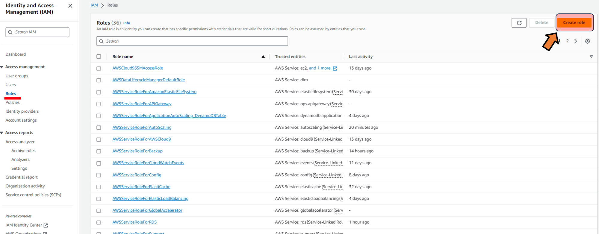

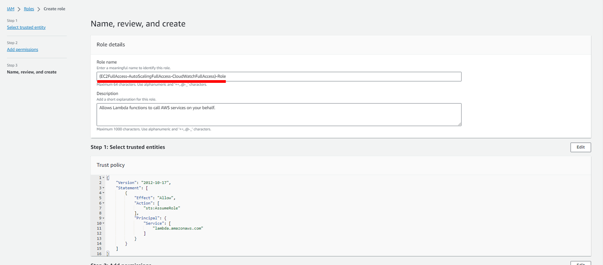
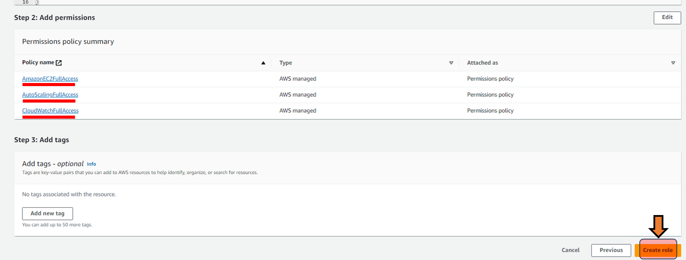

* Create lambda function  `asg-change` with the following settings:

type: author from scratch
runtime: python 3.9
permissions: Use an existing role, choose `asg-change-lambda-role`

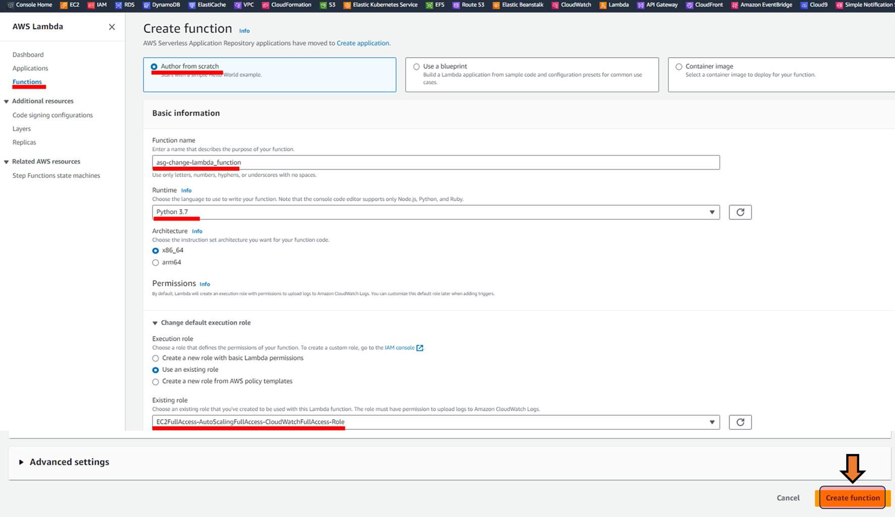
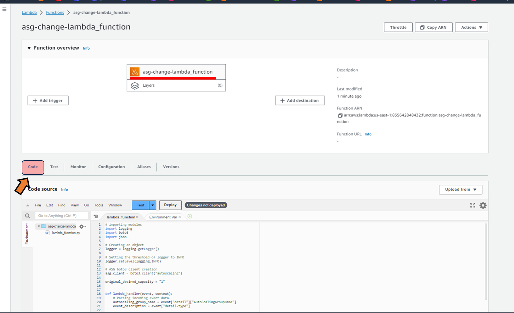

* insert the code:

```python
# importing modules
import logging
import boto3
import json

# Creating an object
logger = logging.getLogger()

# Setting the threshold of logger to INFO
logger.setLevel(logging.INFO)

# ASG boto3 client creation
asg_client = boto3.client("autoscaling")

original_desired_capacity = "1"


def lambda_handler(event, context):
    # Parsing incoming event data.
    autoscaling_group_name = event["detail"]["AutoScalingGroupName"]
    event_description = event["detail-type"]

    # logging the event name and ASG name
    logger.info(
        f"We have just received notice that the Autoscaling Group `{autoscaling_group_name}` has just received an {event_description} event."
    )

    # Getting ASG details
    asg_details = asg_client.describe_auto_scaling_groups(
        AutoScalingGroupNames=[
            autoscaling_group_name,
        ],
    )
    asg_environment_tags = asg_details["AutoScalingGroups"][0]["Tags"]
    new_min_size = asg_details["AutoScalingGroups"][0]["MinSize"]
    new_max_size = asg_details["AutoScalingGroups"][0]["MaxSize"]
    new_desired_size = asg_details["AutoScalingGroups"][0]["DesiredCapacity"]

    logger.info(f"Detected desired capacity was set to: {new_desired_size}")
    logger.info(f"Detected min size was set to: {new_min_size}")
    logger.info(f"Detected max size was set to: {new_max_size}")

    # Getting tags of ASG
    asg_tags = asg_client.describe_tags(
        Filters=[
            {"Name": "auto-scaling-group", "Values": [autoscaling_group_name]}
            # {"Name": "k", "Values": [autoscaling_group_name]},
        ]
    )
    # Getting the tag information, and if matching to `prd`, resetting to the original capacity.
    for tag in asg_tags["Tags"]:
        if tag["Key"] == "env":
            if tag["Value"] == "prd":
                logger.info(
                    f"Production autoscaling group detected. Checking updated capacity status."
                )
                if new_desired_size != 1:
                    logger.info(
                        f"Resetting {autoscaling_group_name} to baseline capacity of {original_desired_capacity}."
                    )
                    asg_client.set_desired_capacity(
                        AutoScalingGroupName=autoscaling_group_name,
                        DesiredCapacity=1,
                        HonorCooldown=False,
                    )
            elif tag["Value"] == "dev":
                logger.info(
                    f"Development autoscaling group detected. Not taking any action."
                )
            else:
                logger.warning(
                    f"Required tags not found. Please add them to the {autoscaling_group_name}."
                )
```

* Observe the code and deploy
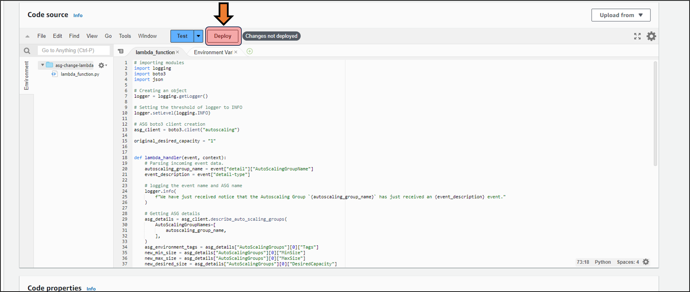

>> EventBridge

* Create an EventBridge Rule - Event Pattern
* Let's create the first part of the event rule.
* Navigate to the EventBridge console.
* Under the Events side menu, select Rules.
* Select the default event bus (if not already selected).
* Click on Create Rule.
* Give your rule a name and, if desired, a description.
  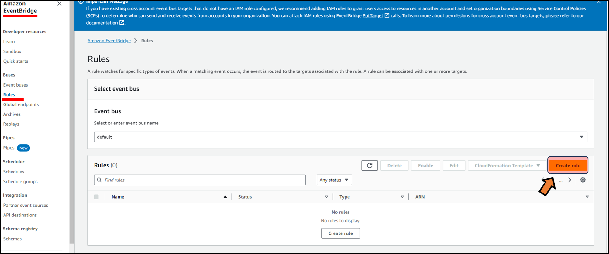
  
  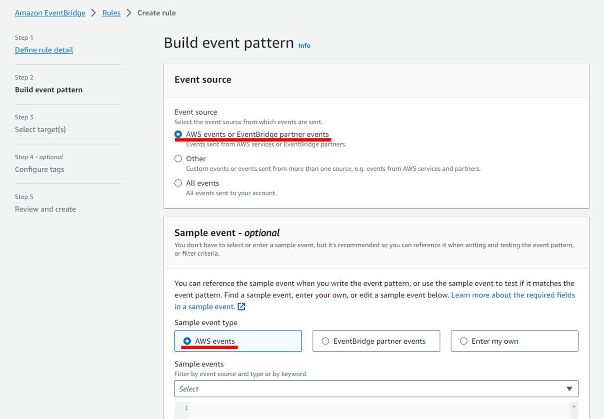
  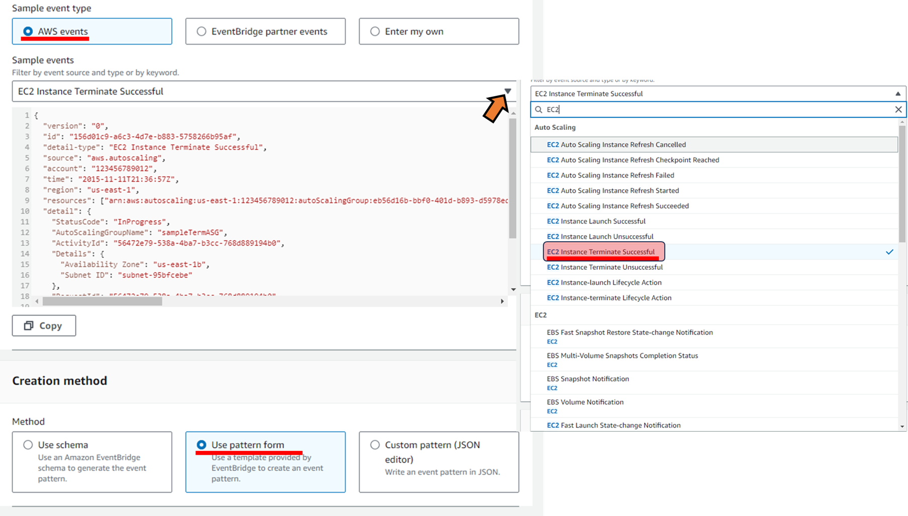
* Select Event Pattern for the Define pattern portion.
* Now, using the guided menus, create a rule based on EC2 Instance Terminations for EC2 auto scaling groups.
* Choose Pre-defined pattern by service
* For Service Provider choose AWS
* Under Service name we select Auto Scaling
* Event type should be set to Instance Launch and Terminate
* Select Specific instance event(s)
* Set it to EC2 Instance Terminate Successful
  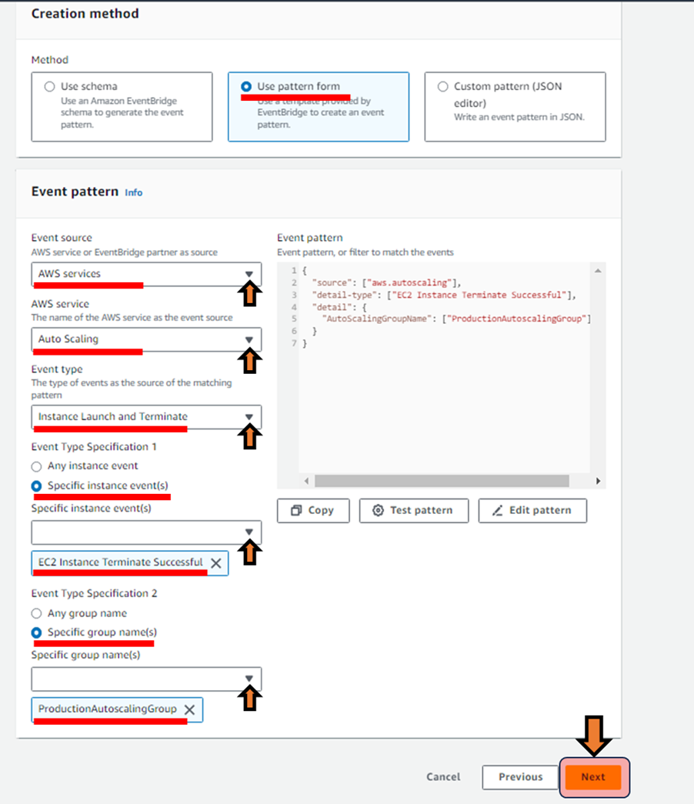
  
  
* Select the Any group name option.

The JSON should look like the provided sample below:
{
  "source": ["aws.autoscaling"],
  "detail-type": ["EC2 Instance Terminate Successful"]
}

* Create an EventBridge Rule - Select Targets

The last portion is to select our targets.

* Under Select targets we need to select Lambda function under the dropdown (if not there by default).
* For the Function selection we pick our LambdaFunction from the menu.
* Select Add Target below the initial configuration.
  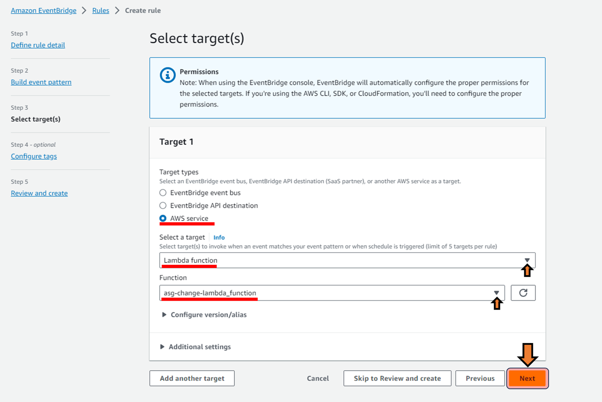
* Tag the resources if desired and then click on Create.
  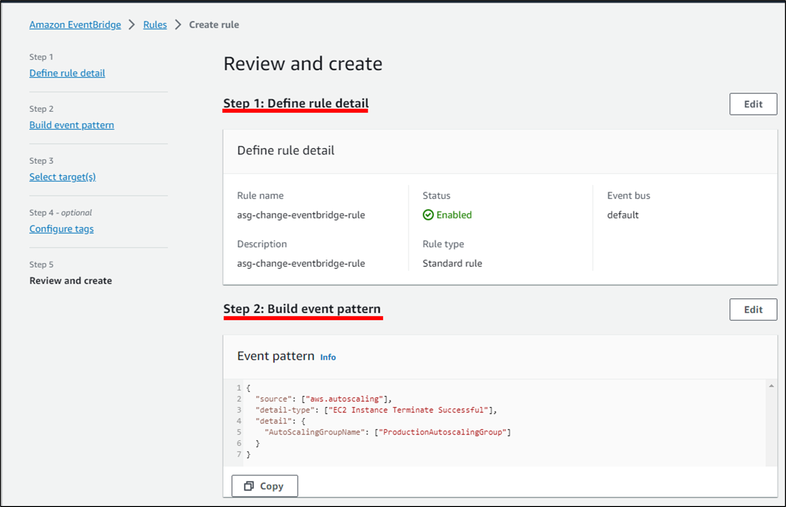
  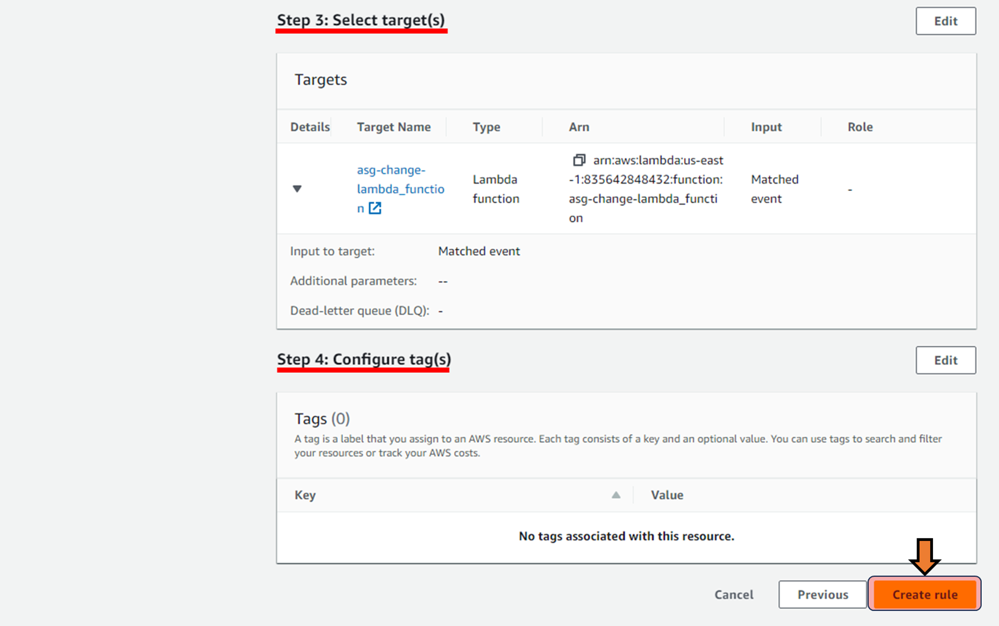
  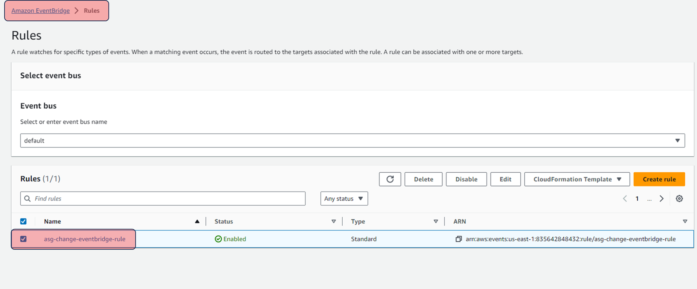
  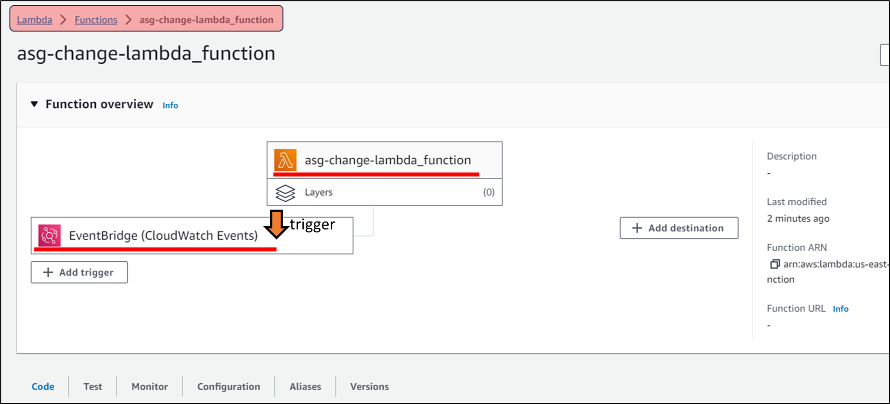

Your rule should be visible in the console with a status of Enabled.

* Test Everything Out

Now that our rule is in place, and our resources are created, let's test the whole solution out.

* Scale Down the Development ASG
* Navigate to the EC2 console.
* Select Auto Scaling Groups
* Find the DevelopmentAutoScalingGroup and select it.
* Under the console menu, select edit and set the desired capacity to zero (0).
* Wait for the EC2 instance to terminate and verify our rule sent an event to EventBridge by ensuring the Lambda function was invoked.
  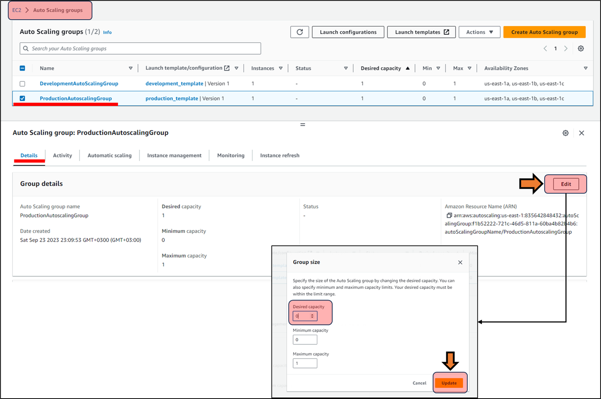
  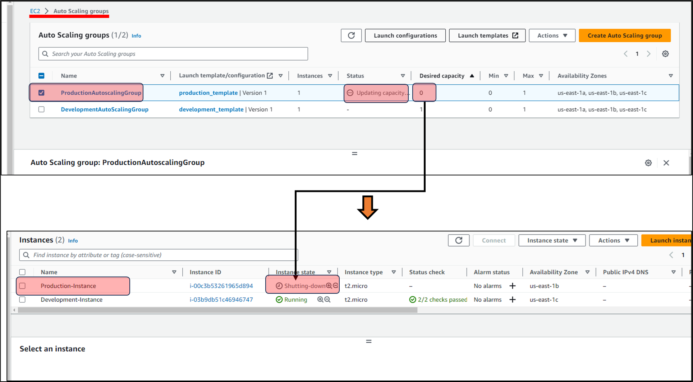
* Navigate to CloudWatch Logs to find and select the Lambda log group and event log stream.
* Verify the logged information is present, detailing the event and ASG name.
* The ASG should be left alone if implemented correctly.

* Scale Down the Development ASG
* Navigate to the EC2 console.
* Select Auto Scaling Groups
* Find the ProductionAutoScalingGroup and select it.
* Under the console menu, select edit and set the desired capacity to zero (0).
* Wait for the EC2 instance to terminate and verify our rule sent an event to EventBridge by ensuring the Lambda function was invoked.
* Navigate to CloudWatch Logs to find and select the Lambda log group and event log stream.
* Verify the logged information is present, detailing the event and ASG name.
* The ASG should be reset to the original capacity of one (1) instance.
  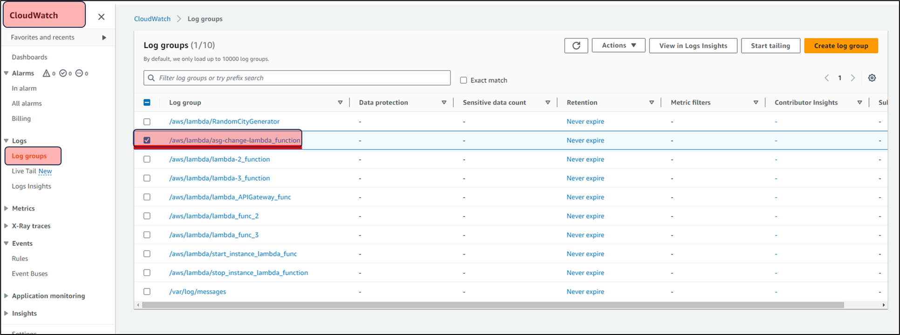
  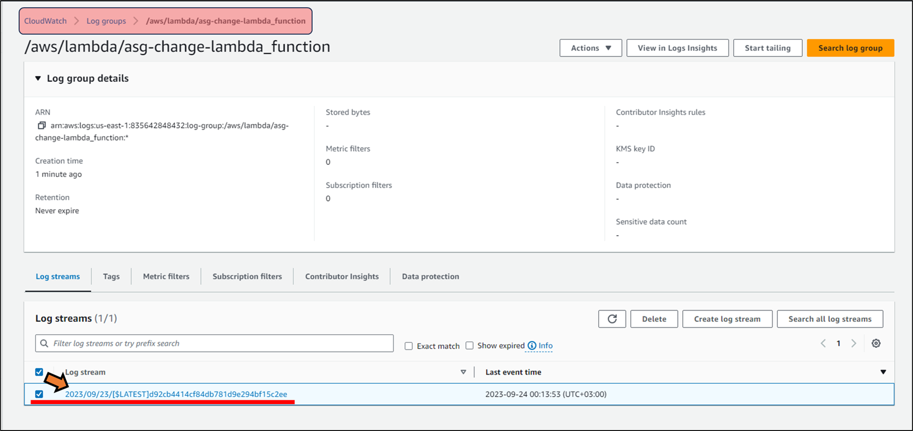
  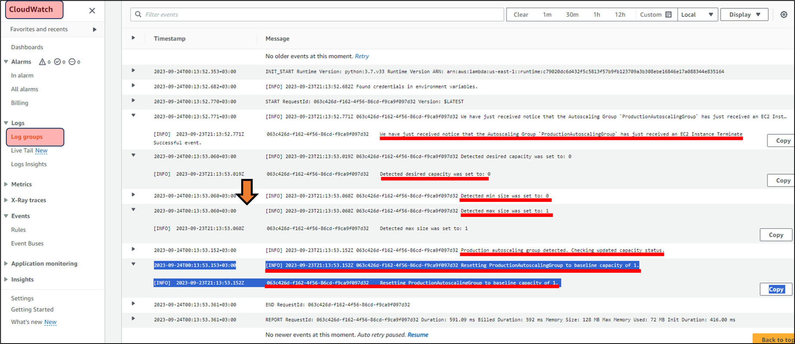
  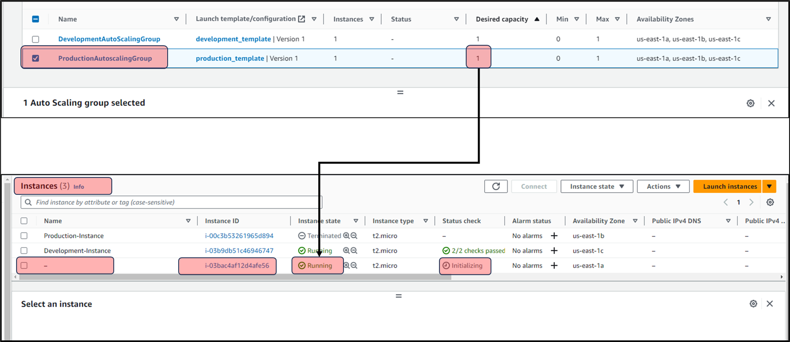
